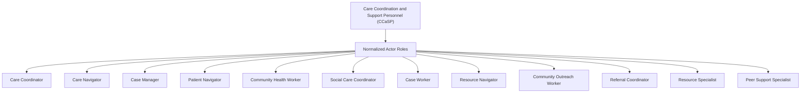
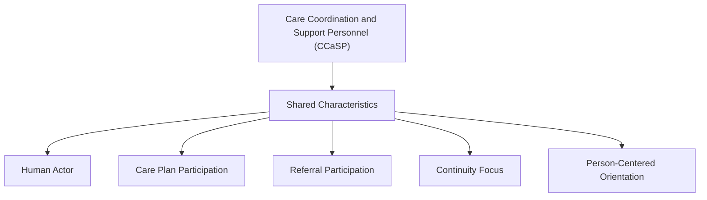
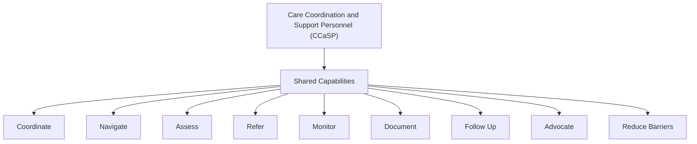
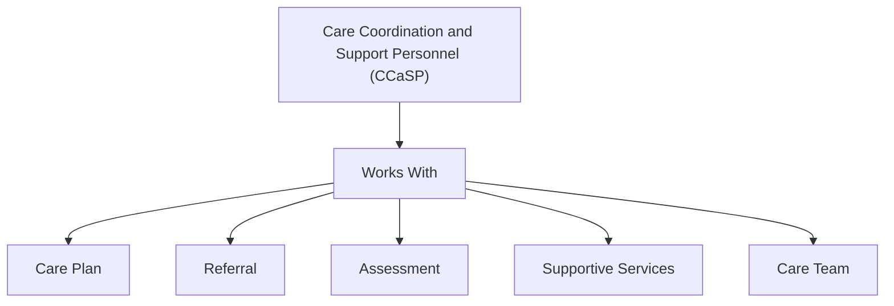

# CCaSP Actor Relationship Diagrams

## 1. Actor Category to Roles

## 2. Actor Category to Shared Characteristics

## 3. Actor Category to Shared Capabilities

## 4. Actor Category to Work Objects

## Interpretation

Care Coordination and Support Personnel (CCaSP) is the canonical actor category.

Specific workforce titles are normalized as actor roles under CCaSP. These roles share common characteristics, perform shared capabilities, and work with artifacts such as care plans, referrals, assessments, supportive services, and care teams.

This diagram set separates:

- **Actor category** — CCaSP
- **Actor roles** — specific workforce titles
- **Shared characteristics** — what these roles have in common
- **Shared capabilities** — what these roles do
- **Artifacts / work objects** — what these roles interact with

## Interpretation

Care Coordination and Support Personnel (CCaSP) is the canonical actor category.

Specific workforce titles are normalized as actor roles under CCaSP. These roles share common characteristics, perform shared capabilities, and work with artifacts such as care plans, referrals, assessments, supportive services, and care teams.

This diagram separates:

* Actor category — CCaSP
* Actor roles — specific workforce titles
* Shared characteristics — what these roles have in common
* Shared capabilities — what these roles do
* Artifacts / work objects — what these roles interact with
